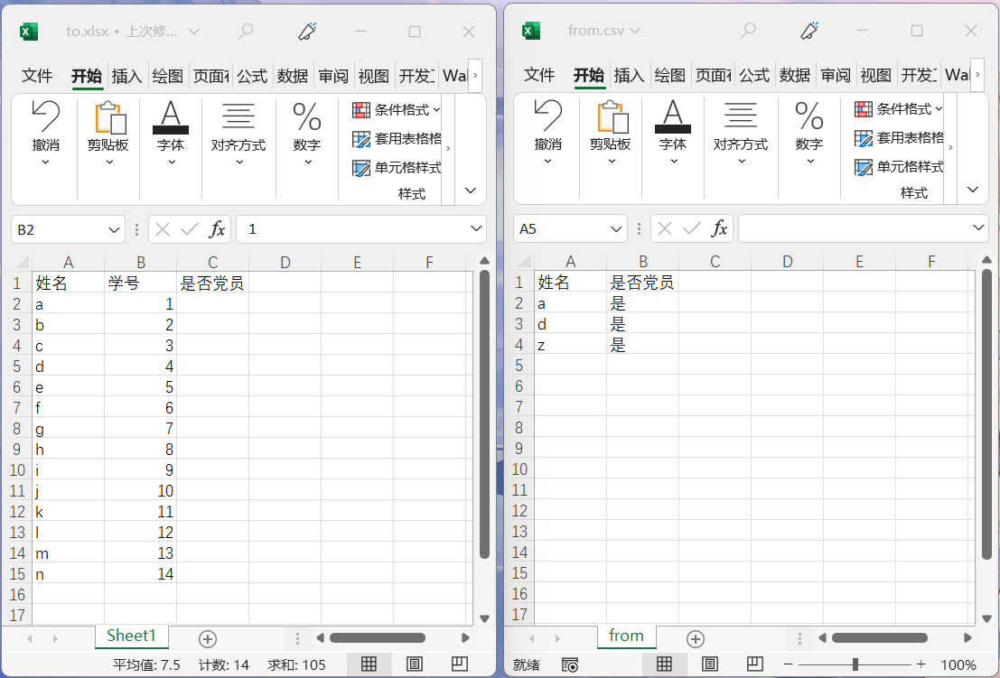
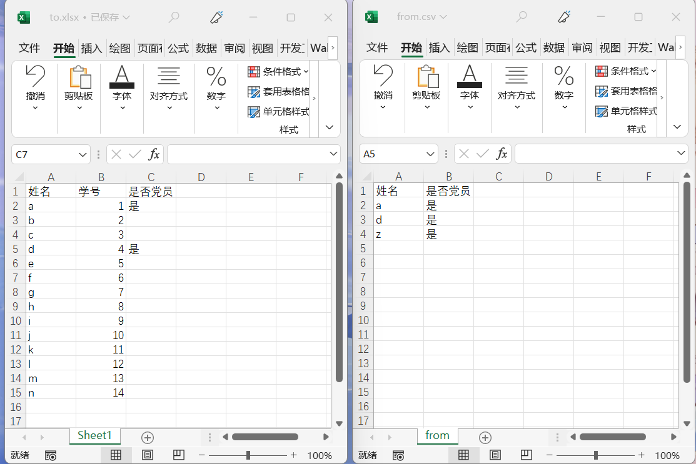

# 表格合并

## 介绍
* 还在为下图中的场景而发愁吗？
  
* 欢迎尝试本项目，将`from.csv`中的数据合并到`to.csv`中，实现如下效果。
  
* 支持格式：from和to都支持csv/xlsx/xls格式。

## 使用方法
* 从[release](https://github.com/Do1e/MergeForms/releases/latest)下载最新版本的exe文件。
* 或者`python ui.py`运行。

* 尚未经过严格测试，如有问题欢迎提issue。
