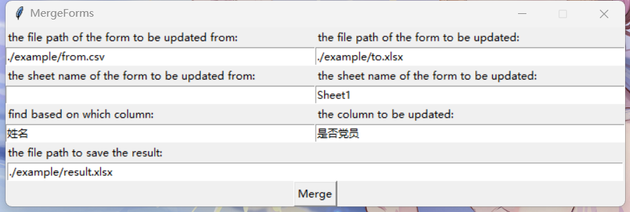

# 表格合并

## 介绍
* 还在为下图中的场景而发愁吗？
  
* 欢迎尝试本项目，将`from.csv`中的数据合并到`to.csv`中，实现如下效果。
  
* 支持格式：from和to都支持csv/xlsx/xls格式。

## 使用方法
* 安装依赖
  ```shell
  pip install -r requirements.txt
  ```
* 运行
  ```shell
  python ui.py
  ```
* 以上述示例为例，输入信息。
  
* 可以在`config.json`中设置默认值，比如：
  ```json
  {
    "from": "./example/from.xlsx",
    "to": "./example/to.xlsx",
    "fromsheet": "Sheet1",
    "tosheet": "Sheet1",
    "baserow": "姓名",
    "updatecol": "是否党员",
    "savename": "./example/result.xlsx"
  }
  ```
  注：如果文件中包含中文，请使用`gbk`编码。

* 尚未经过严格测试，如有问题欢迎提issue。